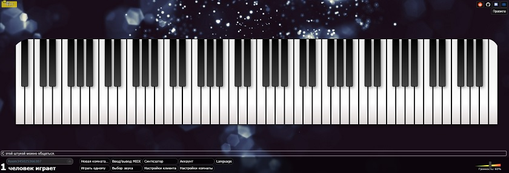
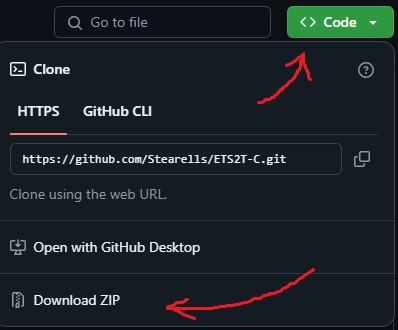
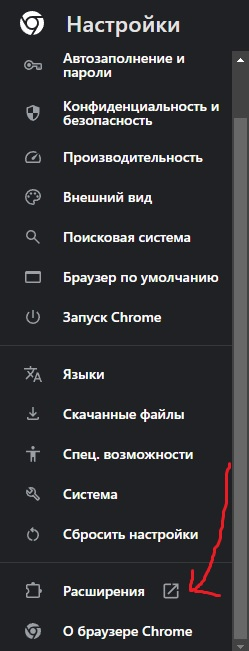
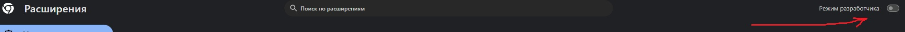
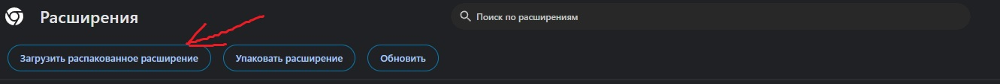
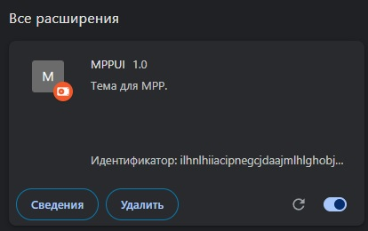

# mppui

MppUI - это альтернативная тема для [MultiPlayerPiano](https://multiplayerpiano.net), созданная в виде расширения для браузера Google Chrome.



## Установка
### 1. Клонируйте репозиторий:

```bash
$ git clone https://github.com/stearells/mppui.git
```

Или скачайте архив:
[MPPUI](https://github.com/Stearells/mppui/archive/refs/heads/master.zip)



(Во втором случае требуется распаковать архив в любое удобное место)

### 2. Перейдите в настройки Google Chrome.

### 3. Перейдите в настройки расширений.


### 4. Включите режим разработчика.


### 5. Нажмите "Загрузить распакованное расширение".


### 6. В открывшемся диалоге укажите путь к директории MPPUI/extension

### 7. Расширение начнёт работать сразу после установки.

